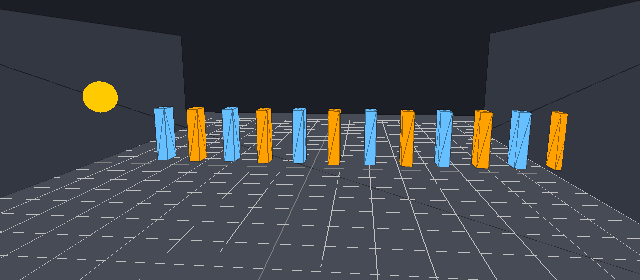
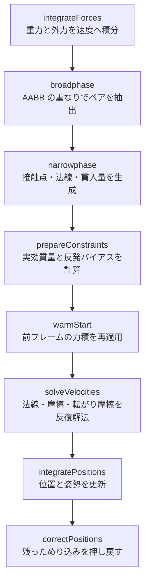
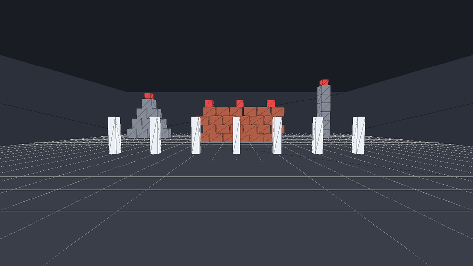
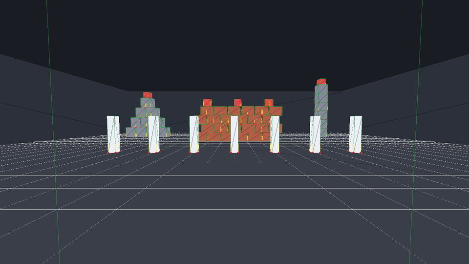

# 3D Physics Demo

C++17 と raylib で作った、自作の 3D 剛体物理エンジンのデモです。
外部の物理エンジンは使わず、衝突判定と接触ソルバを `phys/` 以下にゼロから実装しています。
raylib は描画のみに使用します。



## Overview

| レイヤ | ファイル | 内容 |
|---|---|---|
| 数学 | `phys/math3d.h` | `Vec3` / `Mat3` / `Quat` / `AABB` |
| 剛体 | `phys/body.h` | 質量・慣性テンソル・形状・力積の適用 |
| 衝突判定 | `phys/collision.{h,cpp}` | 接触点と法線の生成（narrow phase） |
| ワールド | `phys/world.{h,cpp}` | 時間積分・broad phase・接触ソルバ |
| デモ | `test.cpp` | ドミノのシーン（`test` ターゲット） |
| ゲーム | `game.cpp` | FPS 視点の当たり判定検証（`game` ターゲット） |

## Demo scene

`test.cpp` の `buildScene()` が組むシーンです。

| 物体 | 形状 | 質量 | 備考 |
|---|---|---|---|
| 地面 | 箱 30 × 2 × 30 | 静的 | `friction 0.7` |
| 壁 | 箱 1 × 5 × 16 を左右に 2 枚（`x = ±8.5`） | 静的 | 横に流れすぎるのを防ぐ |
| ドミノ | 箱 0.36 × 1.8 × 0.64 を 12 枚 | 1.0 | `friction 0.9`、1.2 間隔 |
| ボール | 球 半径 0.55 | 2.0 | 初速 `+x` 方向に 7.8 m/s |

ボールがドミノ列に突っ込み、連鎖が伝播します。

## Physics pipeline

`World::step(dt)` は毎フレーム次の順で処理します。



## Collision detection

| 組み合わせ | 手法 |
|---|---|
| 球 – 球 | 中心間距離と半径和の比較。接触点は 2 面の中間 |
| 球 – 箱 | 箱のローカル座標へ変換し、AABB への最近点を求める。中心が内部にある場合は最浅の面へ押し出す |
| 箱 – 箱 | SAT で 15 軸（面 3 + 面 3 + 稜線の外積 9）を判定。面接触は参照面／入射面を Sutherland–Hodgman でクリップし、接触点を最大 4 点まで削減。稜線同士は 2 直線の最近点 |

## Contact solver

Sequential impulse による反復解法です。

- **Warm starting** — 接触点を剛体ローカル座標（`localA` / `localB`）で前フレームと対応付け、力積を引き継ぐ
- **摩擦** — 法線に直交する接線 2 方向。クーロン摩擦を `±μ·Pn` のクランプで近似
- **転がり摩擦** — 法線まわり・接線まわりの角力積として適用し、球が転がり続けるのを抑える
- **反発** — 接近速度が `restitutionThreshold` 未満のときは無効化し、静止時の微小バウンドを防ぐ
- **位置補正** — 速度解決後に、`penetrationSlop` を超えためり込みだけを直接押し戻す

## Physics Range（FPS 視点の当たり判定テスト）

`game.cpp` は、当たり判定が本当に正しく動いているかを**歩いて・ぶつかって・撃って**確かめるための一人称ゲームです。



12 個の的（レンガの壁の上に 3・ピラミッドの上に 1・塔の上に 1・手前のピン 7 本）をすべて倒せばクリア。タイムとショット数が出ます。

プレイヤー自身も剛体（質量 5 kg の箱）なので、壁やレンガをすり抜けられません。転倒しないように慣性テンソルの逆行列をゼロにして回転だけ殺しています。接地判定は接触マニフォールドの法線から取っているので、ジャンプもソルバの結果に連動します。

| 入力 | 動作 |
|---|---|
| `W` `A` `S` `D` | 移動 |
| マウス | 視点 |
| `Space` | ジャンプ（接地時のみ） |
| `Shift` | ダッシュ |
| 左クリック | 発射 |
| `Q` | 弾を球／箱で切り替え |
| `Tab` | **当たり判定のデバッグ表示** |
| `R` | リセット |
| `P` | 一時停止（カーソル解放） |

### 当たり判定のデバッグ表示

`Tab` で、ソルバが実際に使っている接触情報をそのまま描画します。



| 色 | 意味 |
|---|---|
| 緑のワイヤーフレーム | 動的な剛体の AABB（broad phase が見ている箱） |
| 灰色のワイヤーフレーム | 静的な剛体の AABB |
| 赤い点 | 接触点 `Contact::position` |
| 黄色い線 | 接触法線（`bodyA` → `bodyB` 向き） |
| マゼンタの線 | 貫入量 `Contact::penetration` |

AABB はワールド軸に平行なので、**傾いて見えたら遠近効果**、AABB が物体より明らかに大きければ実際に傾いている、と見分けられます（FOV が 72° と広いため、画面端の縦線は必ず傾いて見えます）。

### 自己診断

描画なしで物理だけを回し、当たり判定が破綻していないかを数値で検証できます。

```powershell
.\build\Debug\game.exe --selftest
```

```text
[1] settle 3s (no input)        積み上げた箱が静止するか、床をすり抜けないか
[2] fast projectile             26 m/s の弾が薄いピンを貫通しないか
[3] shooting the structures     的が撃ち落とせるか、体が床下に落ちないか
```

1 枚だけ描画して PNG に保存することもできます（上の画像はこれで生成しています）。

```powershell
.\build\Debug\game.exe --shot out.png 90        # 90 フレーム分だけ物理を進めてから撮影
.\build\Debug\game.exe --shot out.png 90 debug  # デバッグ表示つき
```

## Requirements

- Windows
- Visual Studio Build Tools（C++ ワークロード）
- CMake
- Git
- 初回コンフィグ時のみインターネット接続（raylib 5.5 を CMake が取得します）

> [!NOTE]
> この環境では `cmake.exe` が Visual Studio Build Tools 内にあり、PATH に登録されていない場合があります。

## Build

PowerShell で、この README のあるフォルダを開きます。

```powershell
$cmake = "C:\Program Files (x86)\Microsoft Visual Studio\18\BuildTools\Common7\IDE\CommonExtensions\Microsoft\CMake\CMake\bin\cmake.exe"

& $cmake -S . -B build -G "Visual Studio 18 2026"
& $cmake --build build --config Debug
```

`cmake` が PATH にある場合は次の形式でも実行できます。

```powershell
cmake -S . -B build -G "Visual Studio 18 2026"
cmake --build build --config Debug
```

`--target test` / `--target game` で片方だけビルドできます。

## Run

```powershell
.\build\Debug\test.exe    # ドミノのデモ
.\build\Debug\game.exe    # Physics Range（FPS）
```

## Controls（ドミノのデモ `test.exe`）

| 入力 | 動作 |
|---|---|
| 左／右ドラッグ | カメラ回転 |
| ホイール | ズーム（4 〜 90） |
| `A` | 注視点を `+X` へ移動 |
| `D` | 注視点を `-X` へ移動 |
| `Esc` ／ ウィンドウを閉じる | 終了 |

## Project structure

```text
.
├── CMakeLists.txt
├── test.cpp              # ドミノのデモ
├── game.cpp              # Physics Range（FPS・当たり判定検証）
├── phys/
│   ├── math3d.h          # Vec3 / Mat3 / Quat / AABB
│   ├── body.h            # RigidBody, Shape
│   ├── collision.h
│   ├── collision.cpp     # narrow phase（SAT・クリッピング）
│   ├── world.h
│   └── world.cpp         # 積分・broad phase・接触ソルバ
├── docs/
│   ├── demo.gif
│   ├── game.png
│   └── game-debug.png
└── build/                # CMake 生成物（Git 管理外）
```

## Tuning

挙動を調整する主なパラメータは `phys/world.h` の `World` にあります。

| パラメータ | 既定値 | 意味 |
|---|---|---|
| `gravity` | `(0, -9.81, 0)` | 重力加速度 |
| `velocityIterations` | `10` | 速度ソルバの反復回数。増やすと接触が硬くなる |
| `positionIterations` | `3` | めり込み補正の反復回数 |
| `penetrationSlop` | `0.005` | 許容するめり込み量。小さすぎるとジッタが出る |
| `positionCorrection` | `0.4` | 1 反復で解消するめり込みの割合 |
| `restitutionThreshold` | `1.0` | この接近速度未満では反発させない |
| `warmStarting` | `true` | 前フレームの力積を引き継ぐ |

剛体ごとの `restitution` / `friction` / `rollingFriction` / `linearDamping` / `angularDamping` は `phys/body.h` に既定値があり、`test.cpp` で個別に上書きしています。

シーンの配置（ドミノの枚数・間隔・開始位置、ボールの初速）は `test.cpp` の `buildScene()` にまとまっています。

## Notes

- `phys/` の `.cpp` は `CMakeLists.txt` の `test` ターゲットに追加が必要です。`.h` は各 `.cpp` から `#include` されるため追加は不要です。
- ソースは UTF-8 です。MSVC は既定でロケールのコードページ（日本語環境では CP932）として読むため、`CMakeLists.txt` で `/utf-8` を指定しています。

  ```cmake
  target_compile_options(${tgt} PRIVATE $<$<CXX_COMPILER_ID:MSVC>:/utf-8>)
  ```

  これを外すと **C4819** 警告が出ます。さらに悪いことに、日本語コメントを含むファイルを **LF 改行**で保存すると、コメント末尾の全角文字が直後の改行バイトを食べて次の行を巻き込み、ビルドが壊れます（CRLF なら CR が食べられて LF が残るため露見しません）。`/utf-8` を外さないでください。
- `World::contactCount()` は `phys/world.h` で宣言されていますが**定義がありません**。呼ぶとリンクエラーになります（`game.cpp` ではマニフォールドから自前で数えています）。
- 実行がアプリケーション制御ポリシーでブロックされる場合は、組織の管理者に実行許可を確認してください。C++ のコンパイルエラーとは別の問題です。
