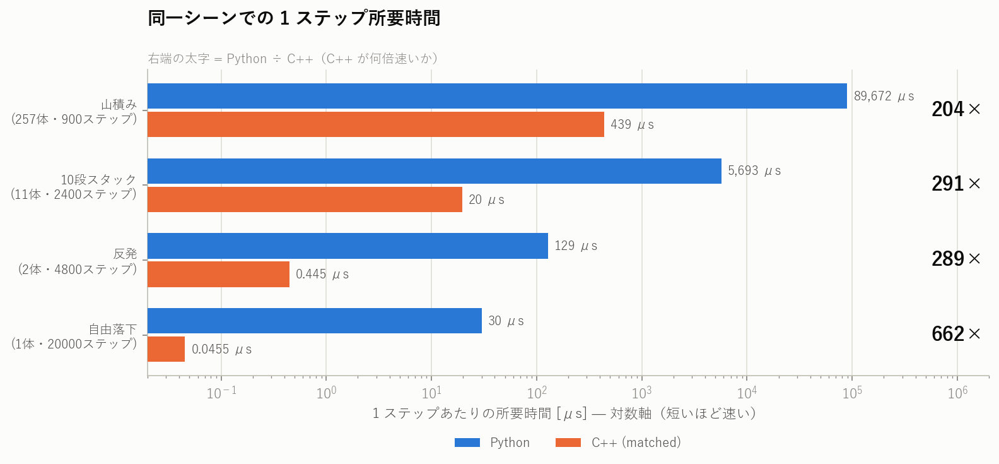
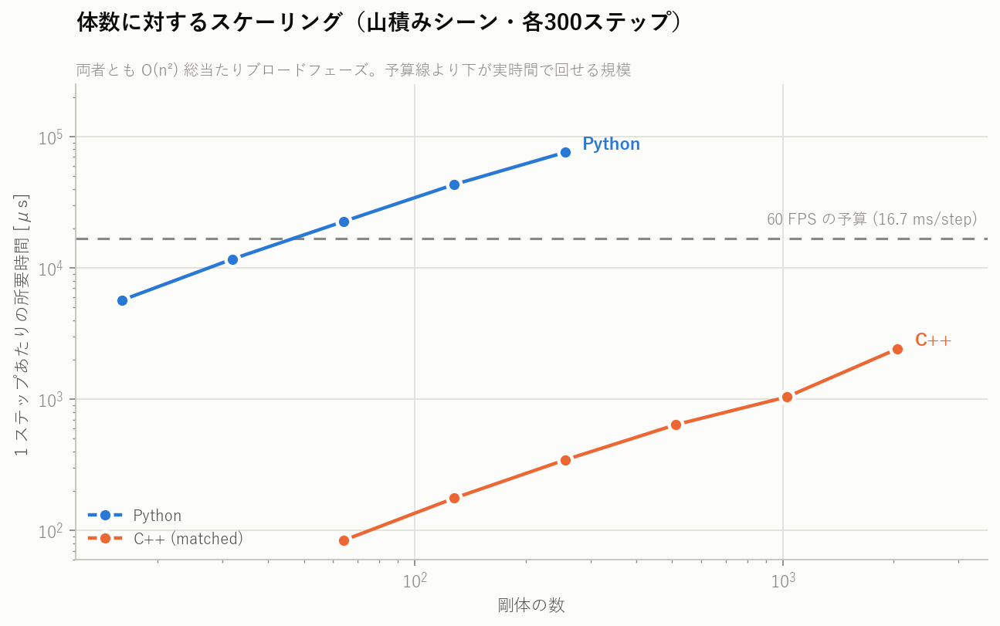
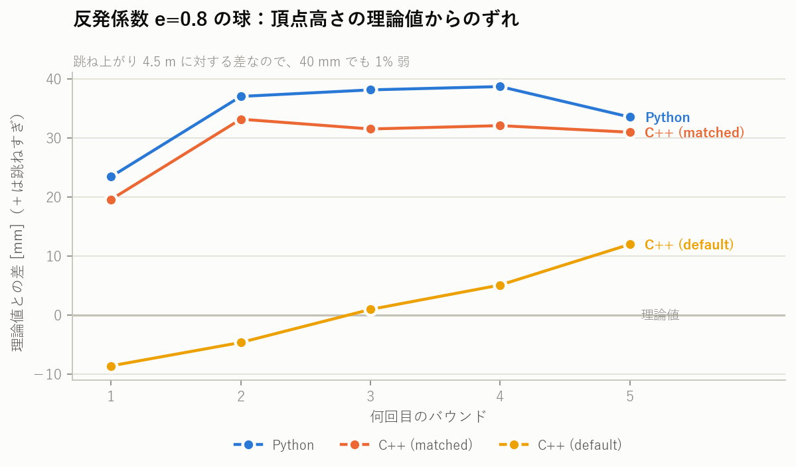
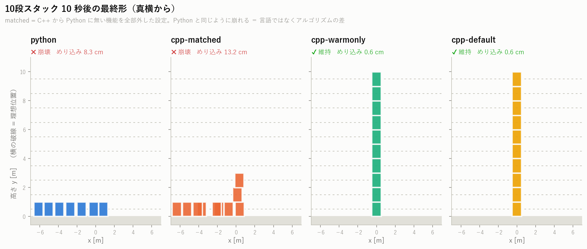
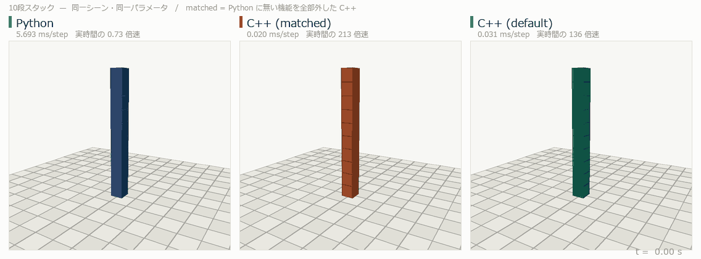
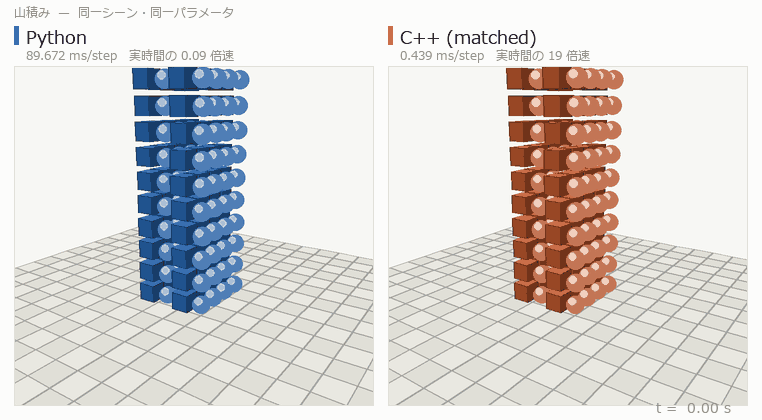

# C++ 物理エンジン vs Python 物理エンジン ベンチマーク

このリポジトリの C++ 物理エンジン（[`phys/`](../phys/)）と、兄弟プロジェクト
`../../3D_claude_code` の Python 物理エンジン（`physics/`）を、**同一シーン・
同一パラメータ・同一初期値**で走らせて速度と精度を比べるためのハーネス。

2 つのエンジンは独立に書かれているが設計は同じ系統で、どちらも

- 半陰的オイラー（シンプレクティックオイラー）で速度 → 位置の順に積分
- AABB の総当たり O(n²) ブロードフェーズ
- SAT + 面クリッピングのナローフェーズ（Box-Box / Sphere-Box / Sphere-Sphere）
- Sequential Impulse ソルバー（速度反復 10 回、2 方向の接線摩擦）
- ステップ後に位置ベースの貫入補正

という構成。だから「同じアルゴリズムを C++ と Python で書いたら何が変わるか」
を比較的きれいに切り出せる。

---

## 1. 何をもって「同じ条件」としたか

素直に走らせると C++ 側は Python 版に無い機能（ウォームスタートなど）を
使ってしまい、言語の差と実装の差が混ざる。そこで C++ 側に 4 つの設定を用意した。

| 設定 | ウォームスタート | 位置補正 | 減衰・転がり摩擦 | 用途 |
|---|---|---|---|---|
| `matched` | OFF | 1 反復 × 0.2 | OFF | **Python と同じアルゴリズム。速度比較の基準** |
| `warmonly` | ON | 1 反復 × 0.2 | OFF | ウォームスタートだけの効果を見る |
| `positiononly` | OFF | 3 反復 × 0.4 | OFF | 位置補正強化だけの効果を見る |
| `default` | ON | 3 反復 × 0.4 | ON | この C++ エンジンの既定設定 |

`matched` で残る非対称も潰してある。

- **反発係数の混合則**が違う（C++ は `max(a,b)`、Python は `sqrt(a·b)`）ので、
  シーン内の全剛体に同じ反発係数を与えて両者の結果を一致させた。摩擦は
  どちらも `sqrt(a·b)` なので元から一致。
- **初期配置の乱数**は自前の LCG（`s = s*1664525 + 1013904223`、上位 24bit を
  2⁻²⁴ 刻みで返す）を両言語に同じ実装で置いた。返り値は 2 の冪分数なので
  float でも double でも厳密に同じ値になる。
- 地面は無限平面ではなく**巨大な静的 Box** にした。C++ 側に Plane 形状が
  無いので、両者とも Box-Box / Sphere-Box の同じコードパスを通す。

### 仕事量が本当に同じかの検算

「速いのは手を抜いているからでは」を潰すため、**検出した接触点の総数**を
両エンジンで数えている（レポートの §6）。山積みシーン 900 ステップで
Python 442,772 点 / C++ 440,371 点。0.5% しか違わないので、同じ量の衝突を
処理したうえでの時間差だと言える。

### それでも残る違い（結果を読むときの前提）

1. **float32 vs float64** — C++ の `Vec3` は `float`、Python は全部 double。
2. **1 接触あたりの接触点数** — C++ は最大 4 点に間引く（`reduceContacts`）、
   Python は面クリップで出た点を全部使う（最大 8 点）。
3. **ソルバー内の解く順序** — C++ は摩擦 → 法線、Python は法線 → 摩擦。
   Gauss-Seidel なので順序が結果に効く。
4. **貫入補正の粒度** — Python はマニフォールド単位で最大深度ぶん剛体を動かす。
   C++ は接触点ごとにローカルアンカーから深度を測り直し、1 回あたり 0.2 m で
   クランプする。反復回数と係数は `matched` で揃えたが、この粒度の差は残る。
5. **AABB の膨張** — C++ は 0.02 だけ膨らませる。候補ペア数にしか影響しない。
6. どちらにもスリープ（静止判定）は無い。

---

## 2. シーンと測定項目

| シーン | 構成 | dt / ステップ数 | 何を見るか |
|---|---|---|---|
| `freefall` | 球 1 個、接触なし、y=100 から落下 | 1/240 s × 20,000 | **数値精度そのもの**。半陰的オイラーには厳密解 `y_k = y₀ − g·dt²·k(k+1)/2` があるので、差はそのまま丸め誤差の蓄積 |
| `bounce` | 反発係数 0.8 の球を y=5 から落とす | 1/240 s × 4,800 | **反発の再現性**。理論頂点 `h_n = 0.5 + 4.5·e^(2n)` と比較 |
| `stack` | 1 m 角の箱 10 段（隙間 0.01 m） | 1/240 s × 2,400 | **ソルバーの安定性**。10 秒後に各段が理想位置 `y = 0.5 + i` に居るか、めり込み・横ドリフト・残留速度 |
| `pile` | 地面 + 箱と球を交互に 256 体（4×4 × 16 層、位置に微小ジッタ） | 1/120 s × 900 | **負荷試験**。接触が数百点規模で持続する状態のスループット |

加えて `pile` を体数を変えて回す**スケーリング測定**（C++: 64〜2048 体、
Python: 16〜256 体、各 300 ステップ）。

精度の指標は次のとおり。

- **解析解との誤差** … `freefall` の最終 y、`bounce` の頂点高さ
- **理想配置との差** … `stack` の各段の中心高さ、水平ドリフト、段間ギャップ
- **物理的な破綻** … 最大めり込み量、静止後の残留速度・残留角速度
- **両エンジンの一致度** … 同一ステップ数走らせた後の位置差（最大・RMS）

---

## 3. 実行方法

必要なもの: Visual Studio Build Tools（または任意の C++17 コンパイラ）、
CMake、Python 3.10+、`matplotlib` と `Pillow`（グラフと GIF 用）。

```powershell
# 全部（10 分ほど。ほとんどは Python 側の実行時間）
powershell -ExecutionPolicy Bypass -File bench\run_all.ps1

# 速度測定だけ手早く
powershell -ExecutionPolicy Bypass -File bench\run_all.ps1 -SkipSweep -SkipGif

# Python エンジンの場所が既定（../../3D_claude_code）と違うとき
powershell -ExecutionPolicy Bypass -File bench\run_all.ps1 -EngineRoot D:\path\to\3D_claude_code
```

個別に動かす場合:

```powershell
cmake -S . -B build
cmake --build build --target bench --config Release

build\Release\bench.exe --out bench\results\cpp_matched.json --config matched
python bench\bench_py.py --out bench\results\py.json
python bench\compare.py python=bench\results\py.json cpp-matched=bench\results\cpp_matched.json
python bench\plot.py --results bench\results --out bench\results
```

生成物は `bench/results/` に出る（`report.txt`、`*.png`、`*.gif`、各 JSON）。

> **注意**: `run_all.ps1` は UTF-8 **BOM 付き**で保存すること。Windows PowerShell 5.1 は
> BOM の無い .ps1 を CP932 として読むため、日本語コメントがあると構文エラーになる。

### ファイル

| ファイル | 役割 |
|---|---|
| `bench_cpp.cpp` | C++ 側のベンチ本体。`phys/` だけに依存（raylib 不要） |
| `bench_py.py` | Python 側のベンチ本体。`bench_cpp.cpp` と 1:1 対応 |
| `compare.py` | 結果 JSON を突き合わせてテキストレポートを出す |
| `plot.py` | グラフ（PNG）を描く |
| `make_gif.py` | 姿勢トレースを GIF に焼くソフトウェアレンダラ（Pillow のみ） |
| `gif_labels.py` | 計測結果からラベルを作って `make_gif` を呼ぶ |
| `stack_depth.py` | 何段まで積めるかを時系列で見る補助スクリプト（Python 側） |
| `run_all.ps1` | 上記を順に実行する |

**シーン定義を変えるときは `bench_cpp.cpp` と `bench_py.py` の両方を直すこと。**
片方だけ変えると比較が成立しない。

---

## 4. 結果

計測環境: Intel Core i7-14700F / Windows 11 / MSVC 14.51 `/O2` x64 / Python 3.14.3

全文は [`results/report.txt`](results/report.txt)。以下は要点。

### 4.1 速度 — C++ が 200〜660 倍速い



| シーン | Python | C++ (matched) | 倍率 |
|---|---:|---:|---:|
| 自由落下 | 30.1 μs/step | 0.046 μs/step | **662×** |
| 反発 | 128.8 μs/step | 0.445 μs/step | **289×** |
| 10段スタック | 5,693 μs/step | 19.5 μs/step | **291×** |
| 山積み (257体) | 89,672 μs/step | 439 μs/step | **204×** |

山積みシーン 900 ステップの総時間は **80.7 秒 対 0.395 秒**。
体数が増えるほど倍率が下がるのは、Python 側の相対的なオーバーヘッド（オブジェクト
生成やディスパッチ）に対して、実際の浮動小数点演算の比重が増えていくため。



60 FPS（16.7 ms/step）に収まる体数は **Python が約 45 体、C++ が約 6,000 体**
（C++ の大体数側は接触がまだ少なく、ブロードフェーズ律速の値）。

### 4.2 精度 — 数値精度は Python、接触の質は C++

**(a) 丸め誤差は Python (double) の勝ち。** 接触のない自由落下 20,000 ステップ：

| | 最終 y | 絶対誤差 | 相対誤差 |
|---|---:|---:|---:|
| Python (double) | −33964.203125011 | 1.10e−08 | 3.2e−13 |
| C++ (float) | −33964.058600 | 1.45e−01 | 4.3e−06 |

`Vec3` が `float` なので当然の結果。34 km 落下して 14 cm のずれ。ゲーム用途では
問題にならないが、長時間の弾道積分や軌道計算をやるなら効いてくる。

**(b) 反発は両者ほぼ一致。** バウンドごとの頂点高さの理論値からのずれ：



理論値との相対誤差（1〜3 バウンド目の平均）は Python 2.02% / C++ matched 1.72%。
**両エンジン同士の差は最大 0.12 mm**（レポート §5）で、`matched` 設定なら
実質同じ軌道を描いている。移植が正しいことの裏取りにもなっている。

**(c) 10段スタック — ここで差がつく。**



| 設定 | 結果 | 最大めり込み | 最大ドリフト |
|---|---|---:|---:|
| Python | **崩壊**（t≈4.5s で倒れ、12 m 先まで散る） | 8.3 cm | 11.98 m |
| C++ `matched` | **崩壊**（下3段だけ残る） | 13.2 cm | 7.96 m |
| C++ `positiononly` | 維持するが揺れ続ける（残留速度 0.36 m/s） | 2.9 cm | 0.49 m |
| C++ `warmonly` | **維持** | 0.56 cm | 0.002 m |
| C++ `default` | **維持** | 0.56 cm | 0.001 m |

C++ を Python と同じアルゴリズムに落とすと**同じように崩れる**。つまりこれは
言語や精度の差ではなく、**ウォームスタートの有無**がほぼ単独で効いている。
位置補正を 3 反復 × 0.4 に強めるだけ（`positiononly`）でも倒れはしないが、
めり込みが 5 倍残り、10 秒たっても速度が抜けない。

Python 版でも 5 段までなら安定する（沈み込み 3.6 cm）。10 段で破綻するのは、
ウォームスタートが無いと法線力の蓄積が毎フレーム 0 からやり直しになり、
速度反復 10 回では上の段の重さを支えきれず、じわじわ沈んだぶんを位置補正が
横方向に押し出すため。

### 4.3 動いている様子

10段スタック（左から Python / C++ matched / C++ default）。
`matched` が Python と同じタイミングで倒れ、`default` だけが立ち続ける：



山積み 257 体（左 Python / 右 C++ matched）。同じ初期配置から始めて、
巨視的には同じ崩れ方をする：



---

## 5. 分かったこと

1. **C++ 版は 200〜660 倍速い。** 同じ量の接触（誤差 0.5%）を処理したうえでの差。
2. **接触の無い純粋な積分精度は Python（double）が 7 桁上。** C++ 側を
   `double` にするか、位置だけ `double` で持てば埋まる。
3. **スタックの安定性の差はウォームスタート由来**で、言語の差ではない。
   Python 版に前フレームの法線・接線力積を引き継ぐ処理（20 行程度）を足せば
   同じ品質になる。
4. **次のボトルネックは両方に共通する O(n²) ブロードフェーズ。**
   C++ でも 2,048 体で 2.4 ms/step、8,192 体で 28.8 ms/step まで落ちる。
   Sweep and Prune か空間ハッシュに替えるのが次の一手。
